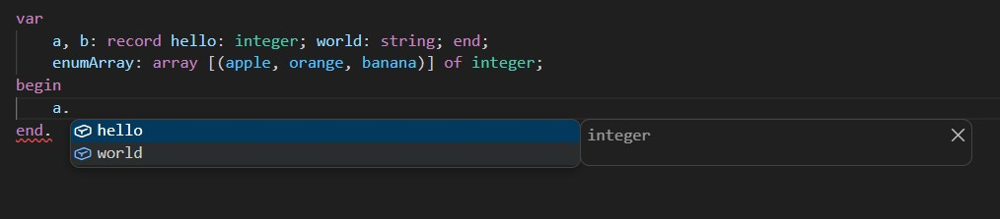
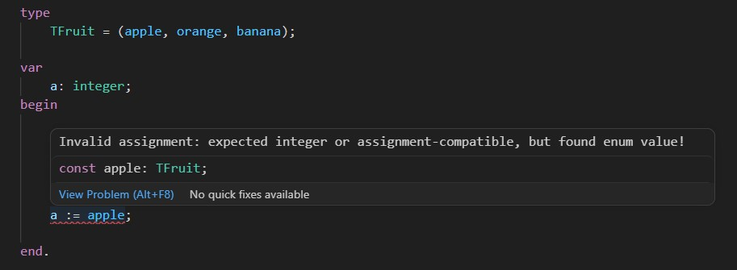
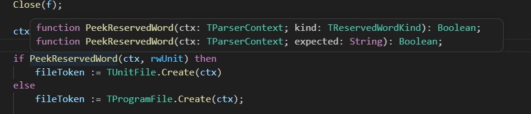
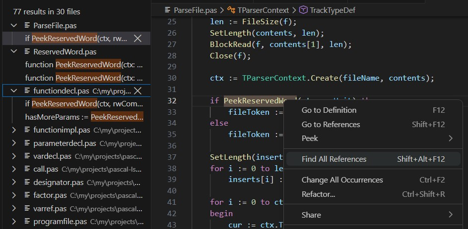
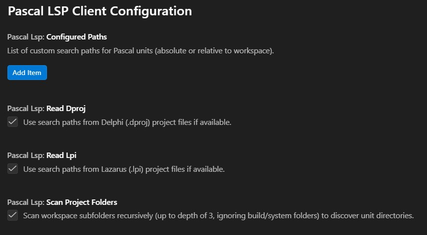

## Pascal Language Server

Pascal parser and language server for VSCode (potentially can be used with other modern editors as well). It is _not_ dependent on Lazarus Code Tools or any other external library. The parser is built from scratch with focus on performance (so that it can be used even with very large projects with millions lines of code) and developer experience (so that it provides a level of code completion and codebase navigation comparable to that of e.g. TypeScript).

### Status

Work in progress.

### Supported features

Code completion:

Diagnostics / syntax errors:

Hover hints:

Find all references:

Also, intelligent syntax highlighting, "Go to definition", Outline, etc.

### Settings

